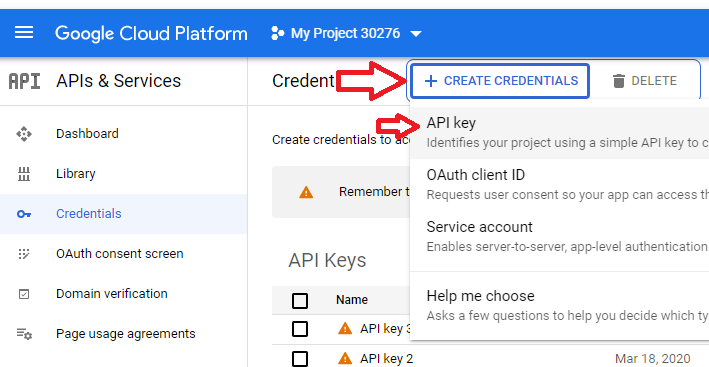
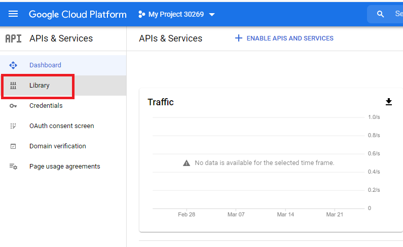
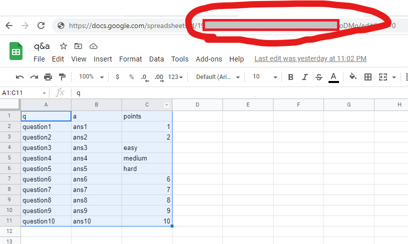

# ChatGame Dock 2.0.0

###### Notes:
**This is widget is NOT intended to be shown on screen but added as an OBS.Live dock!**

***

###### Installation:
In OBS.Live click the VIEW menu -> DOCKS -> CUSTOM BROWSER DOCK
paste this overlay's URL

***

###### Settings:
- Size: 285px min width x 1000px tall
- Position: (0,0)

**Token from jebaited.net with "botSay" & "addPoints" scopes req'd for games.**

Chat stats will count the number of unique chatters per a session and display their 1st message
Chat Games (only enabled if jebaited.net token is correct and has the req'd scopes!)

- Chat Trivia: Type a question or phrase w/ answer. Bot will post question to chat; first user to type the answer correctly wins. (not case sensitive)

- Secret Pin: Input a number/press preselected length and post to chat. Number will be randomized and sent to chat. (Users do not need to use spaces when guessing the answer)

- Scramble Word: Similar to Pin but randomizes a string. Auto fill words can be changed at the bottom of the JS tab.

- AutoPlay: Game will autostart after the time selected when OBS.Live is launched and after each win.

- Points Adder: Maximum additional points added to the base value. i.e. points set to 100 with 100 adder will award a random amount of points between 100-200 points

***
###### Advanced Settings:

####### Start of JS code:
- clearAllData = false | change to true to clear all data. save then change back to false.
- maxLeaderboardRows = 10 | Number of chatters to show on leaderboard
- maxChatHistoryLength = 50 | Maximum number of chats per user before clean-up
- chatActivityMinPoints = 1 | Minimum Points on the slider for bonus points
- chatActivityMaxPoints = 150 | Maximum Points on the slider for bonus points
- chatQuestionEasyPoints = 50 | Default Points for easy questions (or no point value given) when using Google Sheet database for questions
- chatQuestionMedPoints = 75 | Default Points for medium questions when using Google Sheet database for questions
- chatQuestionHardPoints = 100 | Default Points for hard questions when using Google Sheet database for questions

####### Scramble Word Database:
- Bottom of the JS code (Words = []). Change the default words to anything you want.

####### Chat Trivia Google Sheet Database:
**Requires Google API Token & Sheet link**

- Create API Token for Google: https://console.cloud.google.com/apis/credentials

- Restrict API Token for Sheets only:

- Paste this API Key into the Widget Setup

- Create your question & answer database sheet on Google Sheets. **Row 1 is ignored!**
  - Column A: Question
  - Column B: Answer
  - Column C: Points (can be a number, "easy", "medium", or "hard". If not one of these/empty will default to 'easy')
- Get the ID from your link and paste into the Widget Setup

***

###### Credits:
 - StreamElements middleware by lx
 - First Chatters made pretty by JayniusGamingTV
 - Copyright (c)(MIT) 2021 pjonp
