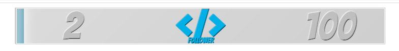
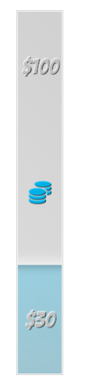

# AiO RotatoGoal
###

## Main Settings
| Setting | Value |
| ------ | ------ |
| Card Color 1 | Card Background Graident Color 1 |
| Card Color 2 | Card Background Graident Color 2 |
| Card Edge Color | Card Edge Color |
| Bar Position | Progress bar over text or under text |
| Flip Direction | Flip up or Flip down |
| Animation Speed | Speed of the animation flip |
| Goal Duratation | Length the goal shows before switching |
| Gradient Transistion (Seconds) | Speed of the graidents |
| Font Style | Font Name |
| Font Color | Main font color |
| Max Font Size | Maximum font size |
| Font Shadow Color | Font shadow color |
| Font Shadow Size | Font shadow offset |
| Label Height (Default: 20) | Height of label container (%) |
| Label Vertical Offset (Default: 0) | Label offset to adjust up or down |
| Label Font Color | Color of label text |
| Icon Size (Default: 100) | Icon size (%) |
| Icon Vertical Offset (Default: 0) | Icon vertical offset |
| Icon Color | Icon color |
| Bar Glow Color 1 | Glow color 1 |
| Bar Glow Color 2 | Glow color 2 |
| Bar Glow Width | Amount of glow for progress bar |

## Advanced Settings
| Setting | Value |
| ------ | ------ |
| Card Perspective (Default: 1500) | Card perspective |
| Perspective Origin | Perspecitve origin |
| Card Radius (Pixels) | Card Radius (THIS OR THICKNESS ! NOT BOTH) |
| Card Thickness (Pixels) | Card Thickness (THIS OR RADIUS ! NOT BOTH) |
| Card Width Override (Default: 80) | Resize as needed to fit perspective |
| Card Height Override (Default: 80) | Resize as needed to fit perspective |
| Currency Locale | Currency Locale |
| Currency Decimals | Display style for currenct $10 vs $10.00 |

## Secret Settings
| Setting | Value |
| ------ | ------ |
| Vertical Bar | Flip to veritcal bar; adjust the Width and Height overrides as needed |

## Goal Options
| Setting | Value |
| ------ | ------ |
| GOAL Enabled | Show this goal? Yes/No |
| GOAL Target Goal | Goal Amount |
| GOAL Icon | Goal Icon or Override |
| IGOAL Icon Override | fontAwesome class / emjoi / text override |
| GOAL Label | Goal Text |
| GOAL Bar Color 1 | Goal Bar Color 1 |
| GOAL Bar Color 2 | Goal Bar Color 2 |

## Examples
#### Copy-Pasta Data Into Data Tab On Overlay Editor
| Title | Image | Size | Data |
|---|---------|---|---|
| Default Horizontal |  | 1000 x 100 | {"FD_platform":"Twitch","FD_cardBgColor1":"rgba(255, 254, 254, 0)","FD_cardBgColor2":"rgba(0, 0, 0, 0.2)","FD_cardEdgeColor":"rgba(0, 0, 0, 0.2)","FD_barOnTop":"0","FD_direction":"1","FD_animationTime":2,"FD_showTime":10,"FD_glowTime":15,"FD_fontName":"Bangers","FD_fontColor":"rgba(255, 255, 255, 0.75)","FD_maxFontSize":145,"FD_fontShadowColor":"rgb(0,0,0)","FD_fontShadowSize":1,"FD_labelHeight":20,"FD_labelPosition":0,"FD_labelColor":"rgba(0, 195, 255, 0.9)","FD_iconSize":100,"FD_iconOffset":0,"FD_iconColor":"rgba(0, 195, 255, 0.9)","FD_barGlowColor":"rgba(0, 0, 0, 0.2)","FD_barGlowColor2":"rgba(255, 255, 255, 0.75)","FD_barGlowWidth":10,"FD_cardPerspective":1500,"FD_cardPerspectiveOrigin":"top left","FD_cardRadius":0,"FD_cardThickness":30,"FD_cardWidth":80,"FD_cardHeight":80,"FD_currencyLocale":"en-US","FD_currencyDecimals":"2","FD_currencyCode":"en-US","FD_vertBar":"no","FD_follower-goal_enabled":"yes","FD_follower-goal_target":100,"FD_follower-goal_icon":"other","FD_follower-goal_iconOther":"fas fa-code","FD_follower-goal_label":"FOLLOWER","FD_follower-goal_barColor1":"rgba(0, 0, 0, 0.25)","FD_follower-goal_barColor2":"rgba(0, 195, 255, 0.3)","FD_tip-goal_enabled":"yes","FD_tip-goal_target":100,"FD_tip-goal_icon":"other","FD_tip-goal_iconOther":"fas fa-code","FD_tip-goal_label":"TIP","FD_tip-goal_barColor1":"rgba(0, 0, 0, 0.25)","FD_tip-goal_barColor2":"rgba(0, 195, 255, 0.3)","FD_cheer-goal_enabled":"yes","FD_cheer-goal_target":100,"FD_cheer-goal_icon":"other","FD_cheer-goal_iconOther":"fas fa-code","FD_cheer-goal_label":"CHEER","FD_cheer-goal_barColor1":"rgba(0, 0, 0, 0.25)","FD_cheer-goal_barColor2":"rgba(0, 195, 255, 0.3)","FD_subscriber-goal_enabled":"yes","FD_subscriber-goal_target":100,"FD_subscriber-goal_icon":"other","FD_subscriber-goal_iconOther":"fas fa-code","FD_subscriber-goal_label":"SUBSCRIBER","FD_subscriber-goal_barColor1":"rgba(0, 0, 0, 0.25)","FD_subscriber-goal_barColor2":"rgba(0, 195, 255, 0.3)","FD_merch-goal-items_enabled":"yes","FD_merch-goal-items_target":100,"FD_merch-goal-items_icon":"other","FD_merch-goal-items_iconOther":"fas fa-code","FD_merch-goal-items_label":"MERCH ITEMS","FD_merch-goal-items_barColor1":"rgba(0, 0, 0, 0.25)","FD_merch-goal-items_barColor2":"rgba(0, 195, 255, 0.3)","FD_merch-goal-orders_enabled":"yes","FD_merch-goal-orders_target":100,"FD_merch-goal-orders_icon":"other","FD_merch-goal-orders_iconOther":"fas fa-code","FD_merch-goal-orders_label":"MERCH ORDERS","FD_merch-goal-orders_barColor1":"rgba(0, 0, 0, 0.25)","FD_merch-goal-orders_barColor2":"rgba(0, 195, 255, 0.3)","FD_merch-goal-total_enabled":"yes","FD_merch-goal-total_target":100,"FD_merch-goal-total_icon":"other","FD_merch-goal-total_iconOther":"fas fa-code","FD_merch-goal-total_label":"MERCH TOTAL","FD_merch-goal-total_barColor1":"rgba(0, 0, 0, 0.25)","FD_merch-goal-total_barColor2":"rgba(0, 195, 255, 0.3)"} |
|
| Default Vertical |  | 900 x 750 | {"FD_platform":"Twitch","FD_cardBgColor1":"rgba(255, 254, 254, 0)","FD_cardBgColor2":"rgba(0, 0, 0, 0.2)","FD_cardEdgeColor":"rgba(0, 0, 0, 0.2)","FD_barOnTop":"0","FD_direction":"1","FD_animationTime":2,"FD_showTime":10,"FD_glowTime":15,"FD_fontName":"Bangers","FD_fontColor":"rgba(255, 255, 255, 0.75)","FD_maxFontSize":35,"FD_fontShadowColor":"rgb(0,0,0)","FD_fontShadowSize":1,"FD_labelHeight":20,"FD_labelPosition":0,"FD_labelColor":"rgba(0, 195, 255, 0.9)","FD_iconSize":100,"FD_iconOffset":0,"FD_iconColor":"rgba(0, 195, 255, 0.9)","FD_barGlowColor":"rgba(0, 0, 0, 0.2)","FD_barGlowColor2":"rgba(255, 255, 255, 0.75)","FD_barGlowWidth":10,"FD_cardPerspective":1300,"FD_cardPerspectiveOrigin":"center","FD_cardRadius":0,"FD_cardThickness":25,"FD_cardWidth":65,"FD_cardHeight":10,"FD_currencyLocale":"en-US","FD_currencyDecimals":"0","FD_currencyCode":"en-US","FD_vertBar":"yes","FD_follower-goal_enabled":"yes","FD_follower-goal_target":100,"FD_follower-goal_icon":"fab fa-twitch","FD_follower-goal_iconOther":"fas fa-code","FD_follower-goal_label":"","FD_follower-goal_barColor1":"rgba(0, 0, 0, 0.25)","FD_follower-goal_barColor2":"rgba(0, 195, 255, 0.3)","FD_tip-goal_enabled":"yes","FD_tip-goal_target":100,"FD_tip-goal_icon":"fas fa-coins","FD_tip-goal_iconOther":"fas fa-code","FD_tip-goal_label":"","FD_tip-goal_barColor1":"rgba(0, 0, 0, 0.25)","FD_tip-goal_barColor2":"rgba(0, 195, 255, 0.3)","FD_cheer-goal_enabled":"yes","FD_cheer-goal_target":100,"FD_cheer-goal_icon":"fas fa-gem","FD_cheer-goal_iconOther":"fas fa-code","FD_cheer-goal_label":"","FD_cheer-goal_barColor1":"rgba(0, 0, 0, 0.25)","FD_cheer-goal_barColor2":"rgba(0, 195, 255, 0.3)","FD_subscriber-goal_enabled":"no","FD_subscriber-goal_target":100,"FD_subscriber-goal_icon":"other","FD_subscriber-goal_iconOther":"fas fa-code","FD_subscriber-goal_label":"SUBSCRIBER","FD_subscriber-goal_barColor1":"rgba(0, 0, 0, 0.25)","FD_subscriber-goal_barColor2":"rgba(0, 195, 255, 0.3)","FD_merch-goal-items_enabled":"no","FD_merch-goal-items_target":100,"FD_merch-goal-items_icon":"other","FD_merch-goal-items_iconOther":"fas fa-code","FD_merch-goal-items_label":"MERCH ITEMS","FD_merch-goal-items_barColor1":"rgba(0, 0, 0, 0.25)","FD_merch-goal-items_barColor2":"rgba(0, 195, 255, 0.3)","FD_merch-goal-orders_enabled":"no","FD_merch-goal-orders_target":100,"FD_merch-goal-orders_icon":"other","FD_merch-goal-orders_iconOther":"fas fa-code","FD_merch-goal-orders_label":"MERCH ORDERS","FD_merch-goal-orders_barColor1":"rgba(0, 0, 0, 0.25)","FD_merch-goal-orders_barColor2":"rgba(0, 195, 255, 0.3)","FD_merch-goal-total_enabled":"no","FD_merch-goal-total_target":100,"FD_merch-goal-total_icon":"other","FD_merch-goal-total_iconOther":"fas fa-code","FD_merch-goal-total_label":"MERCH TOTAL","FD_merch-goal-total_barColor1":"rgba(0, 0, 0, 0.25)","FD_merch-goal-total_barColor2":"rgba(0, 195, 255, 0.3)"} |
|

###### Credits:
 - inspired by RubenSaurus
 - Copyright (c)(MIT) 2021 pjonp
